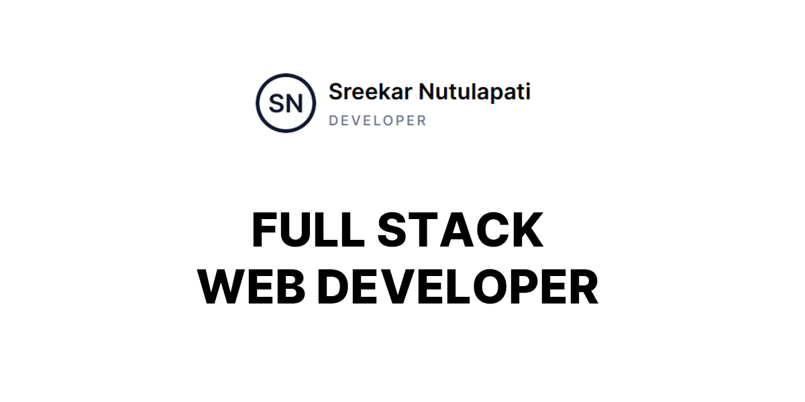
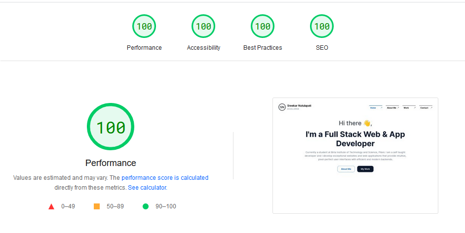
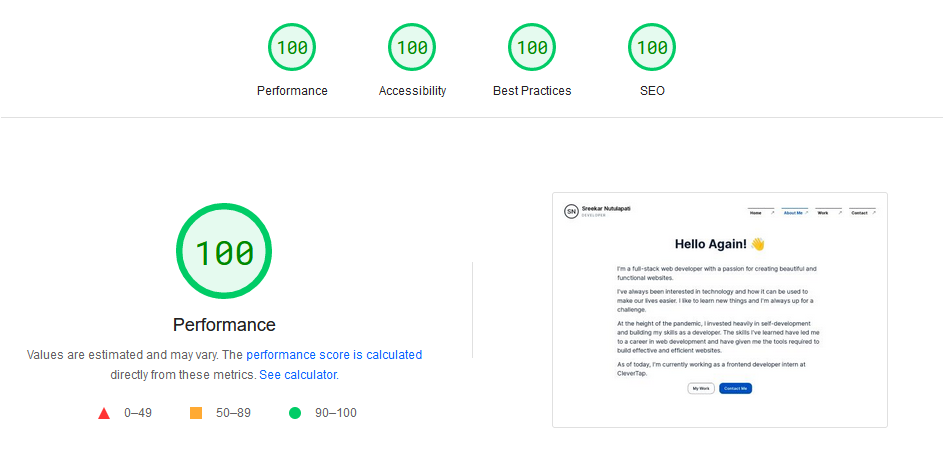
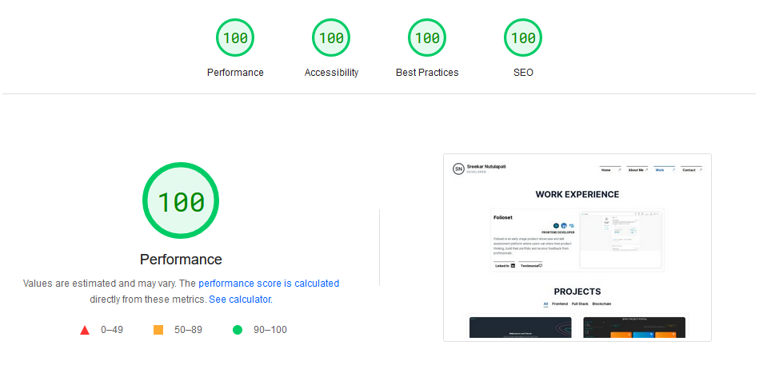
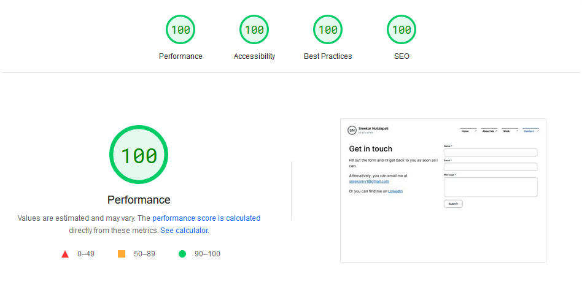

# Overview

This is my offical portfolio website built with Next JS.

# Getting Started

You need to have node and yarn installed on your computer.

    # Clone the repository
    git clone https://github.com/sreekarnv/sreekarnutulapati.vercel.app.git

    # Install yarn globally
    npm i -g yarn

    # Install dependencies
    yarn

    # Run development server
    yarn dev

# PageSpeed Insights

| [Home](https://pagespeed.web.dev/report?url=https%3A%2F%2Fsreekarnutulapati.vercel.app&form_factor=desktop) | [About](https://pagespeed.web.dev/report?url=https%3A%2F%2Fsreekarnutulapati.vercel.app%2Fabout&form_factor=desktop) |
| :---------------------------------------------------------------------------------------------------------: | :------------------------------------------------------------------------------------------------------------------: |
|                                                                                         |                                                                                                 |

| [Work](https://pagespeed.web.dev/report?url=https%3A%2F%2Fsreekarnutulapati.vercel.app%2Fwork&form_factor=desktop) | [Contact](https://pagespeed.web.dev/report?url=https%3A%2F%2Fsreekarnutulapati.vercel.app%2Fabout&form_factor=desktop) |
| :----------------------------------------------------------------------------------------------------------------: | :--------------------------------------------------------------------------------------------------------------------: |
|                                                                                                |                                                                                                 |
|                                                                                                                    |
